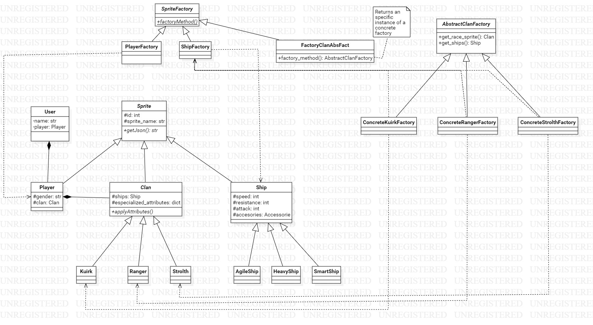

# Abstract Factory Game

## Integranges

* Julián Barrios - 20171020123
* Fabio Ortíz - 20171020051
* Juán Camilo Sánchez - 20171020131

## client
En la carpet `client` se van a alojar todos los archivos relacionados con el frontend de la aplicación.  
Para correr el servidor de cliente, se deben instalar las dependencias mediante 
```commandLine
npm install
```
Y luego, se debe ejecutar
```commandLine
npm run dev
```

## server
En la carpea `server` se van a alojar los módulos que se encargan de manejar la creación de objetos y las requests que vengan del frontend

Para instalar los modules de python, se debe correr el siguiente comando:  
```commandline

pip install -r ./server/requirements.txt

```
## Diagrama de clases

